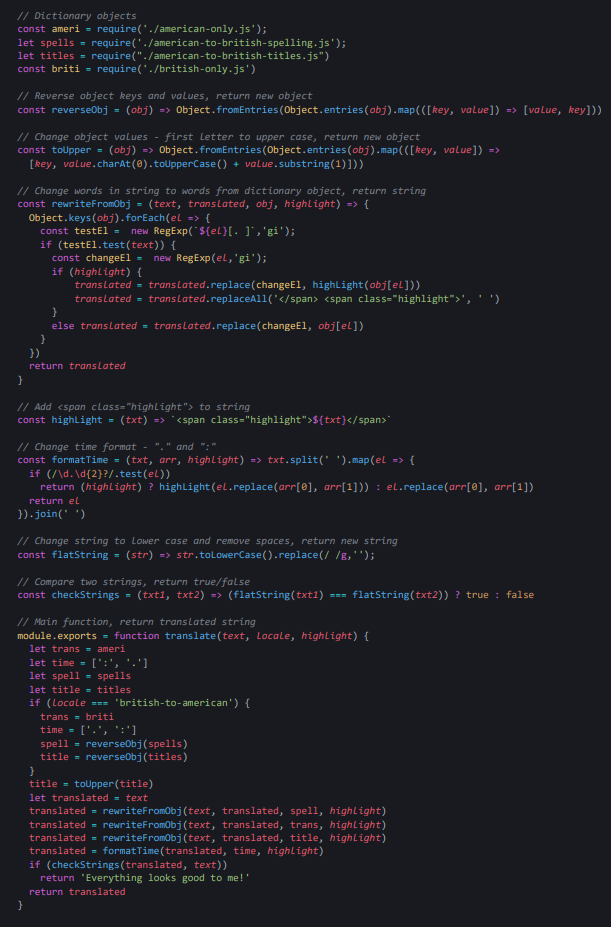

# [freeCodeCamp Quality Assurance certification](https://www.freecodecamp.org/learn/quality-assurance/)

## [American British Translator](https://www.freecodecamp.org/learn/quality-assurance/quality-assurance-projects/american-british-translator)

Working example: https://app-ameri-briti-transl.herokuapp.com/

My git repo: https://github.com/Raff1010X/01.Roadmap

